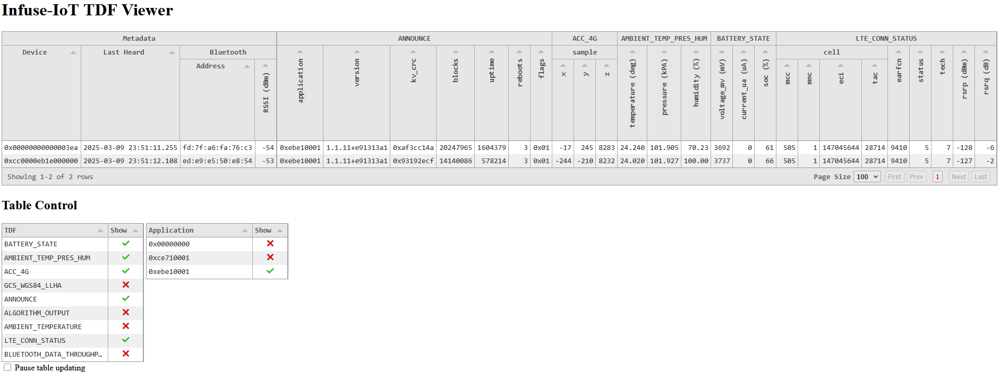

.. _python_tdf:

TDF Viewers
###########

Three separate tools are available to view and record local :ref:`tdf_api` packets.

.. note::

    TDF tools all require a running instance of a :ref:`python_gateways` bridge.

TDF localhost
*************

The localhost tool records the latest values of TDF packets from each devices and
displays them in a table form through a local web browser. The table view is built
on top of `Tabulator`_, providing rich filtering capabilities.

.. code:: bash

    infuse localhost

   Example ``infuse localhost`` webpage display

TDF list
********

The TDF list tool simply prints received TDFs to the terminal with formatting.

.. code:: bash

    infuse tdf_list

.. code:: bash

    Infuse ID: 00000000000003ea
    Interface: BT_ADV
      Address: fd:7f:a6:fa:76:c3 (random)
         RSSI: -56 dBm
    -----------------------  -------------------------  -----------------  --------------  -----
    2025-03-09 23:55:57.680  ANNOUNCE                   application        0xebe10001
                                                        version.major      1
                                                        version.minor      1
                                                        version.revision   11
                                                        version.build_num  0xe91313a1
                                                        kv_crc             0xaf3cc14a
                                                        blocks             20248669
                                                        uptime             1604665
                                                        reboots            3
                                                        flags              0x01
    2025-03-09 23:55:57.680  ACC_4G                     sample.x           -16
                                                        sample.y           242
                                                        sample.z           8283
    2025-03-09 23:55:57.680  LTE_CONN_STATUS            cell.mcc           505
                                                        cell.mnc           1
                                                        cell.eci           147045644
                                                        cell.tac           28714
                                                        earfcn             9410
                                                        status             5
                                                        tech               7
                                                        rsrp               -127            dBm
                                                        rsrq               -5              dB
    2025-03-09 23:55:57.680  BLUETOOTH_DATA_THROUGHPUT  address.type       0
                                                        address.val        0x60fcf10031da
                                                        throughput         323             B/sec
    ...

TDF CSV
*******

The TDF CSV tool records all received TDF packets to CSV files.

.. code:: bash

    infuse tdf_csv

Each unique Infuse ID and TDF pair results in a dedicated file, e.g
``cc0000eb1e000000_BATTERY_STATE.csv``. If a file already exists, new data
is appended to it.

.. code-block::
    :caption: Example CSV content for ``BATTERY_STATE`` TDFs

    time,voltage_mv,current_ua,soc
    2025-03-10T00:00:35.671640,3737,0,66
    2025-03-10T00:00:37.428005,3737,0,66
    2025-03-10T00:00:38.531742,3737,0,66
    2025-03-10T00:00:40.439066,3737,0,66

.. _Tabulator: https://tabulator.info/
